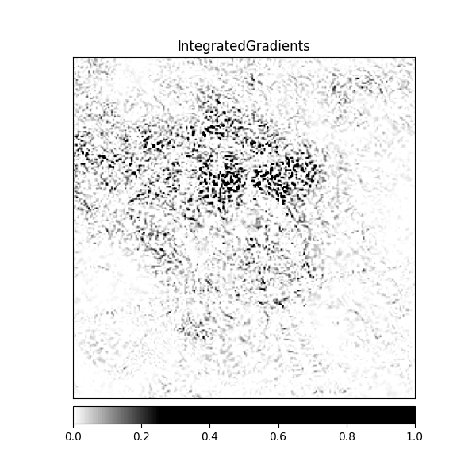
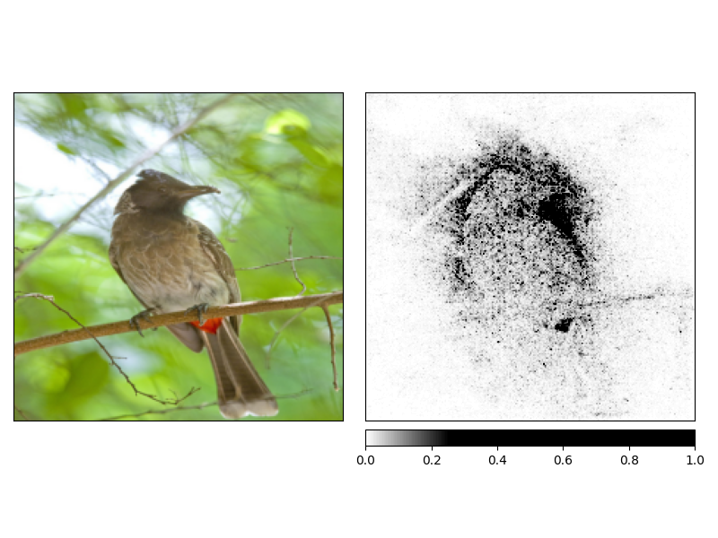
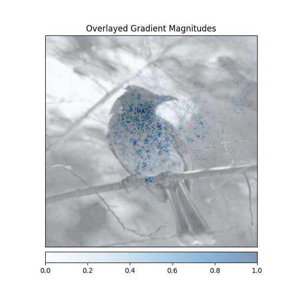
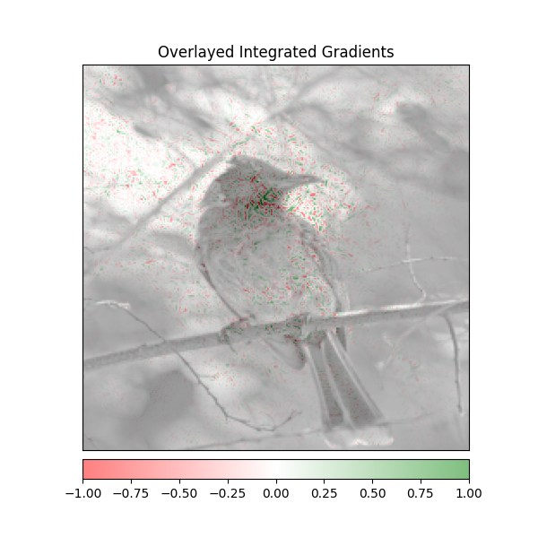
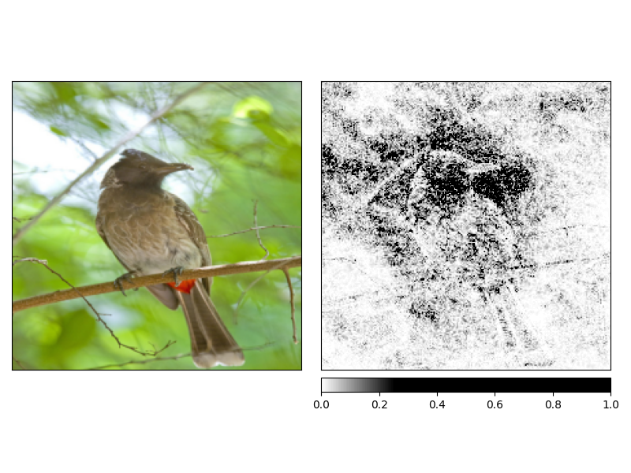
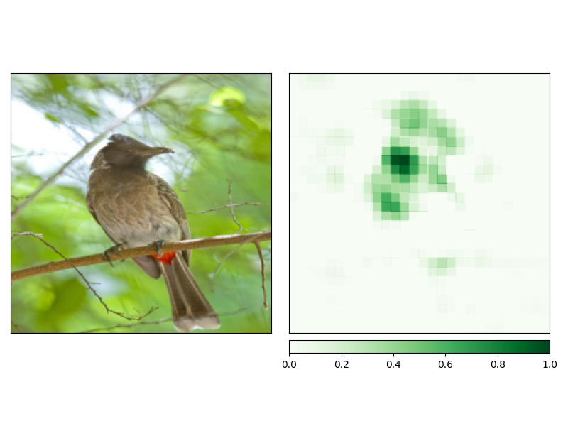
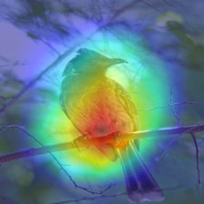
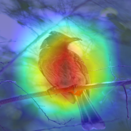

# EMLO Session 7


## Explainability using Different Techniques
To run the script.

```bash
python3 src/explain.py +image=https://raw.githubusercontent.com/EliSchwartz/imagenet-sample-images/master/n01560419_bulbul.JPEG
```

## Integrated Gradients


## Integrated Gradients with Noise

## Saliency


## SHAP


## Occlusion


## GradCAM

## GradCAM++
